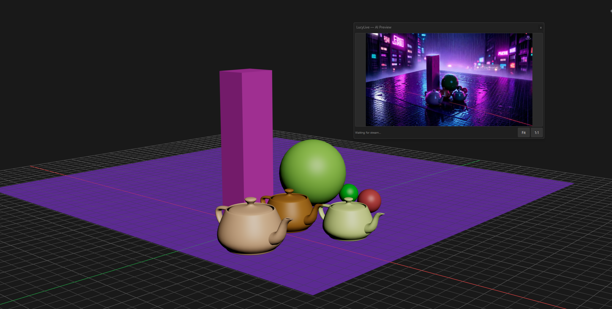

# LucyLive AI — Real-Time AI Rendering for 3ds Max

Transform your 3ds Max viewport into a live AI-rendered scene in real time.

Developed by: Iman Shirani

LucyLive streams your viewport directly to Decart's Lucy 2.5 model via WebRTC and sends back AI-rendered frames — live, as you work. No baking, no waiting for renders. Just type a prompt and watch your scene transform instantly.

---

## ✨ What it does

- Streams your Max viewport to Lucy 2.5 (by Decart) at up to 30fps
- Displays AI output in a floating preview window — like a VFB, always on top
- Use any text prompt to change lighting, style, season, atmosphere
- Record the AI output as a JPEG sequence or MP4
- Use a reference image to guide the style

---

## Requirements

- 3ds Max 2025 / 2026 / 2027
- Decart API key — get one at [platform.decart.ai](https://platform.decart.ai) (~$0.02/sec, free credits available)
- Python dependencies installed via `install.bat`

---

## 📦 Installation

1. Download and extract the folder
2. Run `install.bat` — this sets up the Python environment automatically
3. In 3ds Max, open the Script Editor and run `lucylive_panel.py`
4. The LucyLive panel will dock on the right side of Max

---

## 🛠️ How to use

1. Paste your Decart API key into the API Key field
2. Type a prompt:
   - `autumn forest, golden hour, cinematic photorealistic`
   - `cyberpunk night city, neon reflections, rain, volumetric fog`
   - `misty morning, soft diffused light, cool blue-green tones`
3. Optionally load a reference image to guide the style
4. Hit **Start** — the AI Preview window opens automatically
5. To record, set an output path and hit **⏺ Record**

---

## Prompt tips

Lucy 2.5 is a video-to-video model. Prompts should describe the **visual output**, not give instructions:

| Instead of | Use |
|---|---|
| `make it snowy` | `winter scene, deep snow, cold blue light, photorealistic` |
| `add fog` | `dense morning fog, soft diffused light, atmospheric haze` |
| `night scene` | `night time, moonlight, deep shadows, cinematic lighting` |

---

## Cost

$0.02 / second (~$1.20 / minute) on your Decart account.
Free credits are available at [platform.decart.ai](https://platform.decart.ai).

---

## Notes

- Lucy 2.5 is developed by [Decart](https://platform.decart.ai). This plugin is an independent integration for 3ds Max and is not affiliated with Decart.
- Requires an active internet connection during streaming.

---

*Made by [imanshirani](https://github.com/imanshirani)*
